# 📋 P0 구현 계획서: LangGraph 7-step 오케스트레이션 + Agent Factory 통합

## 📊 현재 상태 분석

### 시스템 구현 현황
- **LangGraph Pipeline**: 80% 구현 (Mock 구현, 실제 LLM 연동 필요)
- **Agent Factory**: 80% 구현 (API 존재, Pipeline 연결 안됨)
- **임베딩 캐시**: ✅ 100% 완료 (FakeRedis 포함, 859,324배 성능 향상 검증)
- **CPU 임베딩 모델**: ✅ 100% 완료 (sentence-transformers all-MiniLM-L6-v2)

### 핵심 문제점
1. **Agent Factory ↔ Pipeline 단절**: 두 시스템이 독립적으로 존재
2. **Intent 분류 미구현**: 키워드 기반 Mock 구현만 존재
3. **LLM 연동 부재**: 실제 답변 생성 로직 없음
4. **Agent 설정 미활용**: Agent별 특화 기능이 Pipeline에 반영 안됨

## 🎯 구현 목표

### PRD 요구사항 달성
- **성능**: p95 ≤ 4초, p99 ≤ 7초
- **비용**: ≤ ₩10/query
- **품질**: Faithfulness ≥ 0.85, Answer Relevance ≥ 0.8
- **확장성**: 동시 사용자 100명, 피크 시 500 QPS

### 기술적 목표
1. Agent Factory가 Pipeline 동작을 실제로 제어
2. CPU 기반 Intent 분류 실시간 동작
3. 캐시 시스템 전체 파이프라인 통합
4. 완전한 E2E 파이프라인 구축

## 🚀 구현 계획

### Phase 1: Agent Factory 실제 구현 (2시간)

#### 1.1 Agent Factory Core 구현
**파일**: `apps/api/agent_factory.py` (신규)
```python
# 주요 구현 내용
- AgentProfile 클래스 (카테고리별 특화 설정)
- AgentConfigBuilder (동적 설정 생성)
- PromptTemplateManager (Agent별 프롬프트)
- ToolSelector (Agent별 도구 선택)
```

**Subagent 활용**:
- **gemini-assistant**: Agent 프로파일 설계 및 최적화 전략 수립
- **classification-pipeline-expert**: 카테고리 기반 분류 로직 검증

#### 1.2 Agent 카테고리별 프로파일 정의
**파일**: `apps/api/agent_profiles.yaml` (신규)
```yaml
# Technology/AI Agent 예시
technology_ai:
  retrieval:
    bm25_weight: 0.3
    vector_weight: 0.7
    rerank_threshold: 0.8
  prompt:
    system: "You are an AI expert..."
    temperature: 0.7
  tools:
    - code_interpreter
    - web_search
```

### Phase 2: Intent Classification 실제 구현 (1.5시간)

#### 2.1 임베딩 기반 Intent Classifier
**파일**: `apps/orchestration/src/intent_classifier.py` (신규)
```python
# 주요 구현 내용
- EmbeddingIntentClassifier (sentence-transformers 활용)
- IntentCache (임베딩 캐시 통합)
- ConfidenceScorer (신뢰도 계산)
- IntentRouter (의도별 라우팅)
```

**Subagent 활용**:
- **hybrid-search-specialist**: 임베딩 기반 검색 최적화
- **classification-pipeline-expert**: 분류 파이프라인 아키텍처 설계

#### 2.2 Intent 학습 데이터 준비
```python
# Intent 카테고리 정의
INTENT_CATEGORIES = {
    "search": ["검색", "찾아", "find", "search"],
    "classify": ["분류", "카테고리", "classify"],
    "explain": ["설명", "알려줘", "explain"],
    "analyze": ["분석", "평가", "analyze"],
    "compare": ["비교", "차이점", "compare"]
}
```

### Phase 3: Pipeline-Factory 통합 (2시간)

#### 3.1 Pipeline 초기화 수정
**파일**: `apps/orchestration/src/langgraph_pipeline.py` (수정)
```python
class LangGraphPipeline:
    def __init__(self, agent_factory=None):
        self.agent_factory = agent_factory or AgentFactory()
        self.intent_classifier = IntentClassifier()
        # Agent 설정 로드
        self.agent_config = None
```

**Subagent 활용**:
- **langgraph-orchestrator**: LangGraph 통합 아키텍처 검증
- **api-designer**: API 인터페이스 설계 검토

#### 3.2 동적 파이프라인 구성
```python
async def execute(self, request: PipelineRequest):
    # 1. Agent 설정 로드
    if request.agent_id:
        self.agent_config = await self.agent_factory.get_agent(request.agent_id)

    # 2. Agent 설정에 따른 파이프라인 조정
    if self.agent_config:
        self._configure_pipeline(self.agent_config)
```

### Phase 4: LLM Service Layer (1.5시간)

#### 4.1 LLM 추상화 레이어
**파일**: `apps/orchestration/src/llm_service.py` (신규)
```python
class LLMService:
    def __init__(self, provider="openai"):
        self.provider = provider
        self.client = self._init_client()

    async def generate(self, prompt, agent_config=None):
        # Agent 설정 적용
        if agent_config:
            temperature = agent_config.get("temperature", 0.7)
            max_tokens = agent_config.get("max_tokens", 2000)
```

**Subagent 활용**:
- **gemini-assistant**: LLM 프롬프트 최적화 전략
- **observability-engineer**: 토큰 사용량 및 비용 모니터링 설계

#### 4.2 프롬프트 템플릿 관리
```python
class PromptTemplateManager:
    templates = {
        "technology_ai": {
            "system": "You are an AI expert...",
            "user": "Based on context: {context}\nAnswer: {query}"
        }
    }
```

### Phase 5: 통합 테스트 및 검증 (1시간)

#### 5.1 컴포넌트 단위 테스트
**파일**: `tests/test_agent_factory.py`
```python
async def test_agent_creation():
    factory = AgentFactory()
    agent = await factory.create_from_category(["Technology", "AI"])
    assert agent.profile.name == "technology_ai"
```

**Subagent 활용**:
- **rag-evaluation-specialist**: RAGAS 평가 프레임워크 적용
- **security-compliance-auditor**: 보안 및 성능 검증

#### 5.2 E2E 통합 테스트
**파일**: `tests/test_e2e_pipeline.py`
```python
async def test_full_pipeline():
    # Agent Factory로 에이전트 생성
    agent = await factory.create_from_category(["Technology", "AI"])

    # Pipeline 실행
    response = await pipeline.execute(
        query="AI RAG 시스템 설명",
        agent_id=agent.id
    )

    # 검증
    assert response.confidence > 0.8
    assert response.latency < 4.0  # p95 목표
```

## 📊 작업 분배 및 Subagent 활용 계획

### Subagent 역할 분담

| Subagent | 담당 작업 | 예상 기여도 |
|----------|---------|------------|
| **gemini-assistant** | 고수준 아키텍처 검토, 프롬프트 최적화 | 25% |
| **classification-pipeline-expert** | Intent 분류 시스템 설계 | 20% |
| **hybrid-search-specialist** | 검색 및 임베딩 최적화 | 15% |
| **langgraph-orchestrator** | Pipeline 통합 검증 | 15% |
| **api-designer** | API 인터페이스 설계 | 10% |
| **rag-evaluation-specialist** | 품질 평가 시스템 | 10% |
| **observability-engineer** | 모니터링 및 로깅 | 5% |

### 병렬 작업 전략

```mermaid
gantt
    title P0 구현 타임라인
    dateFormat HH:mm
    section Phase 1
    Agent Factory Core    :a1, 00:00, 1h
    Agent Profiles        :a2, after a1, 1h

    section Phase 2
    Intent Classifier     :b1, 00:30, 1h
    Intent Training Data  :b2, after b1, 30m

    section Phase 3
    Pipeline Integration  :c1, after a2, 2h

    section Phase 4
    LLM Service          :d1, after b2, 1h
    Prompt Templates     :d2, after d1, 30m

    section Phase 5
    Testing              :e1, after c1 d2, 1h
```


## 🎯 성공 지표

### 기능적 완성도
- [ ] Agent Factory가 실제로 Pipeline 동작 제어
- [ ] Intent 분류 정확도 > 85%
- [ ] E2E 파이프라인 완전 동작
- [ ] 캐시 시스템 모든 단계 통합

### 성능 지표
- [ ] p95 latency ≤ 4초
- [ ] 캐시 히트율 > 70%
- [ ] 토큰 비용 ≤ ₩10/query
- [ ] 동시 처리 > 100 요청

### 품질 지표
- [ ] Faithfulness ≥ 0.85
- [ ] Answer Relevance ≥ 0.8
- [ ] 테스트 커버리지 > 80%

## 🔧 기술 스택

### 핵심 기술
- **LangGraph**: 파이프라인 오케스트레이션
- **sentence-transformers**: CPU 임베딩 (all-MiniLM-L6-v2)
- **FakeRedis**: 개발환경 캐싱
- **FastAPI**: API 서버

### 개발 도구
- **pytest**: 테스트 프레임워크
- **RAGAS**: RAG 품질 평가
- **locust**: 부하 테스트

## 📝 리스크 및 대응 방안

### 기술적 리스크
1. **LLM API 비용 초과**
   - 대응: Mock LLM 우선 사용, 점진적 실제 API 전환

2. **Intent 분류 성능 부족**
   - 대응: 규칙 기반 폴백, 하이브리드 접근

3. **Pipeline 복잡도 증가**
   - 대응: 단계별 독립 테스트, 모듈화 강화

### 일정 리스크
1. **통합 이슈 발생**
   - 대응: Subagent 병렬 작업으로 시간 단축

2. **테스트 시간 부족**
   - 대응: 핵심 경로 우선 테스트

## 🚀 실행 단계

### Step 1: 환경 준비 (10분)
```bash
# 필요 패키지 확인
pip list | grep -E "langchain|sentence-transformers|fakeredis"

# 개발 서버 시작
cd apps/api && uvicorn main:app --reload --port 8000
```

### Step 2: Agent Factory 구현 (2시간)
```bash
# Gemini assistant 활용하여 설계 검토
# Agent Factory Core 구현
# Agent Profiles 정의
```

### Step 3: Intent Classifier 구현 (1.5시간)
```bash
# Classification expert와 함께 설계
# 임베딩 기반 분류기 구현
# 캐시 통합
```

### Step 4: Pipeline 통합 (2시간)
```bash
# LangGraph orchestrator 검증
# Agent Factory 연결
# 동적 구성 테스트
```

### Step 5: 테스트 및 검증 (1시간)
```bash
# 단위 테스트 실행
pytest tests/test_agent_factory.py -v

# 통합 테스트
pytest tests/test_e2e_pipeline.py -v

# 성능 테스트
locust -f tests/load_test.py --host=http://localhost:8000
```

## 📅 예상 완료 시간

**총 작업 시간**: 6-8시간
- Agent Factory: 2시간
- Intent Classifier: 1.5시간
- Pipeline 통합: 2시간
- LLM Service: 1.5시간
- 테스트: 1시간

**Subagent 활용 시 단축 예상**: 30-40% (병렬 작업)
**실제 예상 시간**: 4-5시간

## 🔄 다음 단계

### P1 작업 준비
1. PostgreSQL + pgvector 마이그레이션 설계
2. RAGAS 평가 자동화 시스템 구축
3. Langfuse 모니터링 통합

### 장기 개선 사항
1. Multi-Agent 협업 시스템
2. 자동 프롬프트 최적화
3. A/B 테스트 프레임워크

---

*이 계획서는 DT-RAG v1.8.1 PRD를 기반으로 작성되었으며, 실제 구현 시 상황에 따라 조정될 수 있습니다.*