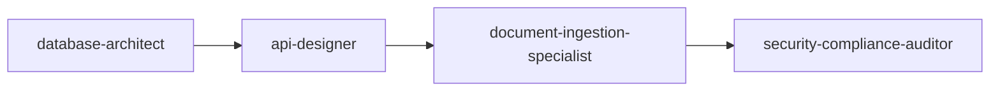
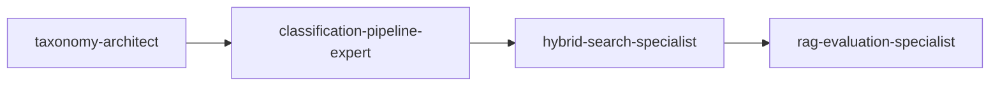
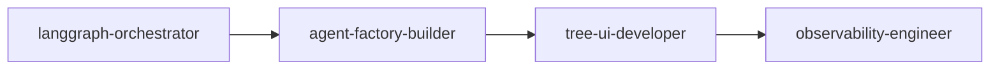

# Dynamic Taxonomy RAG v1.8.1 - Subagents 명세서

## 📋 개요

본 문서는 Dynamic Taxonomy RAG v1.8.1 프로젝트 개발을 위한 Claude Code Subagents의 상세 명세를 제공합니다. PRD 분석을 기반으로 12개의 전문 Subagents를 설계하여 복잡한 프로젝트 요구사항을 체계적으로 구현할 수 있도록 합니다.

### 프로젝트 핵심 정보
- **프로젝트**: Dynamic Taxonomy RAG v1.8.1
- **목표 출시**: 2025-09-16 10:00 (KST)
- **핵심 비전**: 동적 다단계 카테고리화(DAG+버전/롤백) + 트리형 UI + 전문 에이전트 생성

### 성공 지표 (KPI)
| 구분 | 지표 | 목표 | 비고 |
|------|------|------|------|
| 품질 | Faithfulness | ≥ 0.85 | RAGAS 기반 |
| 성능 | p95 지연 | ≤ 4s | 전체 파이프라인 |
| 비용 | 평균 비용/쿼리 | ≤ ₩10 | 모델·툴 포함 |
| 사용성 | CSAT | ≥ 4.3/5.0 | 챗/트리뷰/Agent Factory |
| 운영 | 롤백 TTR | ≤ 15분 | 자동화 스크립트 |

---

## 🏗️ 시스템 아키텍처

### 전체 구조
```
Dynamic Taxonomy RAG v1.8.1
├── 📥 Document Pipeline
│   ├── 인입 (CSV/URL/파일)
│   ├── PII 필터링
│   ├── 라이선스 태깅
│   └── 청킹/임베딩
├── 🌳 Taxonomy Management
│   ├── DAG 구조 설계
│   ├── 버전 관리 (MAJOR.MINOR.PATCH)
│   └── 마이그레이션/롤백
├── 🏷️ Classification System
│   ├── 룰 기반 1차 분류
│   ├── LLM 2차 분류
│   └── HITL 큐 관리
├── 🔍 Search & Retrieval
│   ├── BM25 검색
│   ├── Vector 검색
│   └── Cross-Encoder Rerank
├── 🤖 Agent Factory
│   ├── 매니페스트 생성
│   ├── 카테고리 필터링
│   └── 도구 화이트리스트
├── 🎭 Orchestration
│   ├── LangGraph 7-Step
│   ├── Planner-Executor
│   └── MCP 통합
├── 🖥️ Frontend
│   ├── 트리 UI
│   ├── 챗 UI
│   └── HITL 인터페이스
└── 📊 Operations
    ├── 모니터링 (Langfuse)
    ├── 보안/컴플라이언스
    └── 품질 평가
```

---

## 🤖 Subagents 상세 명세

### 1. Core Pipeline Subagents

#### 1.1 document-ingestion-specialist

**기본 정보**
```markdown
---
name: document-ingestion-specialist
description: 문서 인입 파이프라인 구현 전문가. CSV/URL/파일 처리, PII 필터링, 라이선스 태깅, 청킹 구현
tools: Read, Write, Edit, Bash, Grep
---
```

**전문 영역**
- 다양한 문서 포맷 처리 (CSV, JSON, PDF, TXT, URL)
- PII(개인식별정보) 자동 필터링 시스템
- 라이선스 및 버전 태깅 관리
- 지능형 청킹 전략 (500 tokens, overlap 128)
- 중복 검사 및 데이터 품질 관리

**핵심 구현 책임**
1. **파일 파서 팩토리 구현**
   ```python
   class DocumentParserFactory:
       @staticmethod
       def get_parser(file_type: str) -> BaseParser:
           parsers = {
               'csv': CSVParser(),
               'json': JSONParser(), 
               'pdf': PDFParser(),
               'txt': TextParser(),
               'url': URLParser()
           }
           return parsers.get(file_type, TextParser())
   ```

2. **PII 필터링 엔진**
   - 이메일: `r'[\w\.-]+@[\w\.-]+\.\w+'`
   - 전화번호: `r'\d{3}-\d{4}-\d{4}'`
   - 주민번호: `r'\d{6}-[1-4]\d{6}'`
   - 커스텀 규칙 확장 가능

3. **청킹 최적화**
   - 토큰 기반 분할 (tiktoken 사용)
   - 의미 단위 보존
   - 오버랩 전략으로 컨텍스트 유지

**품질 기준**
- 처리 실패율 < 1%
- PII 필터링 정확도 > 99%
- 청킹 일관성 100%
- 처리 속도: 1MB/초 이상

---

#### 1.2 taxonomy-architect

**기본 정보**
```markdown
---
name: taxonomy-architect
description: 동적 택소노미 DAG 구조 설계 및 버전 관리 시스템 구현
tools: Read, Write, Edit, MultiEdit, Bash
---
```

**전문 영역**
- DAG(Directed Acyclic Graph) 구조 설계
- 버전 관리 시스템 (Semantic Versioning)
- 데이터베이스 스키마 아키텍처
- 마이그레이션 및 롤백 전략

**핵심 구현 책임**
1. **DAG 구조 관리**
   ```python
   class TaxonomyDAG:
       def __init__(self):
           self.nodes = {}
           self.edges = {}
           
       def add_node(self, node_id: str, canonical_path: List[str]):
           # 순환 참조 검사
           if self.creates_cycle(node_id, canonical_path):
               raise ValueError("Cycle detected")
               
       def validate_integrity(self) -> bool:
           # DAG 무결성 검증
           return self.is_acyclic() and self.is_connected()
   ```

2. **버전 관리 시스템**
   - MAJOR.MINOR.PATCH 시맨틱 버저닝
   - Diff 알고리즘 (추가/이동/병합/삭제)
   - 브랜치 관리 및 머지 전략

3. **마이그레이션 엔진**
   ```sql
   -- taxonomy_migrations 테이블
   CREATE TABLE taxonomy_migrations (
       from_version TEXT,
       to_version TEXT,
       from_path TEXT[],
       to_path TEXT[],
       rationale TEXT,
       created_at TIMESTAMP DEFAULT now()
   );
   ```

4. **롤백 메커니즘**
   - 트랜잭션 기반 롤백
   - 15분 이내 TTR 보장
   - 감사 로그 유지

**품질 기준**
- 롤백 TTR ≤ 15분
- 무결성 제약 100% 준수
- 버전 충돌 0%
- DAG 순환 참조 0%

---

#### 1.3 classification-pipeline-expert

**기본 정보**
```markdown
---
name: classification-pipeline-expert
description: 혼합 분류 파이프라인 구현 (룰→LLM→교차검증→HITL)
tools: Read, Write, Edit, WebSearch, Task
---
```

**전문 영역**
- 3단계 혼합 분류 시스템
- Confidence 산출 알고리즘
- HITL(Human-In-The-Loop) 워크플로우
- 드리프트 탐지 및 품질 보장

**핵심 구현 책임**
1. **3단계 분류 파이프라인**
   ```python
   class ClassificationPipeline:
       def classify(self, text: str) -> ClassificationResult:
           # 1차: 룰 기반 분류
           rule_candidates = self.rule_classifier.classify(text)
           
           # 2차: LLM 분류 (후보 3개 + 근거 2개)
           llm_candidates = self.llm_classifier.classify(text)
           
           # 3차: 교차 검증 및 Confidence 산출
           final_result = self.cross_validator.validate(
               rule_candidates, llm_candidates
           )
           
           return final_result
   ```

2. **Confidence 계산 공식**
   ```python
   def calculate_confidence(self, result: ClassificationResult) -> float:
       # Rerank 점수 (40%)
       rerank_score = result.rerank_score * 0.4
       
       # Source agreement (30%)
       agreement_score = self.calculate_source_agreement(result) * 0.3
       
       # Answer consistency (30%)
       consistency_score = self.calculate_consistency(result) * 0.3
       
       return rerank_score + agreement_score + consistency_score
   ```

3. **HITL 통합 시스템**
   - Confidence < 0.70 자동 큐잉
   - 드리프트 탐지 알고리즘
   - 보정 워크플로우 및 학습 루프

4. **성능 최적화**
   - 배치 처리로 효율성 향상
   - Redis 캐싱으로 응답 속도 개선
   - 비동기 처리로 확장성 보장

**품질 기준**
- Faithfulness ≥ 0.85
- HITL 요구율 ≤ 30%
- 분류 정확도 ≥ 90%
- 처리 지연 < 2초

---

#### 1.4 database-architect

**기본 정보**
```markdown
---
name: database-architect
description: PostgreSQL + pgvector 스키마 설계 및 최적화 전문가
tools: Read, Write, Edit, Bash
---
```

**전문 영역**
- PostgreSQL 16 + pgvector 아키텍처
- 벡터 인덱싱 최적화 (IVFFlat, HNSW)
- Alembic 마이그레이션 관리
- 쿼리 성능 튜닝

**핵심 구현 책임**
1. **스키마 설계**
   ```sql
   -- 핵심 테이블 구조
   CREATE TABLE documents (
       doc_id UUID PRIMARY KEY,
       source_url TEXT,
       version_tag TEXT,
       license_tag TEXT,
       created_at TIMESTAMP DEFAULT now()
   );
   
   CREATE TABLE embeddings (
       chunk_id UUID PRIMARY KEY,
       vec VECTOR(1536),
       bm25_tokens TSVECTOR
   );
   
   CREATE INDEX ON embeddings USING ivfflat (vec vector_cosine_ops)
   WITH (lists = 100);
   ```

2. **pgvector 최적화**
   - IVFFlat 인덱스 튜닝 (lists 파라미터)
   - HNSW 인덱스 (고성능 옵션)
   - 벡터 차원 최적화

3. **Alembic 마이그레이션**
   ```python
   def upgrade():
       op.execute('CREATE EXTENSION IF NOT EXISTS vector')
       op.create_table('taxonomy_nodes',
           sa.Column('node_id', sa.UUID(), primary_key=True),
           sa.Column('canonical_path', sa.ARRAY(sa.Text())),
           sa.Column('version', sa.Text()),
           sa.Column('confidence', sa.Float())
       )
   ```

4. **성능 모니터링**
   - 슬로우 쿼리 탐지
   - Connection pooling 최적화
   - 인덱스 사용률 분석

**품질 기준**
- 쿼리 응답 < 100ms (p95)
- 동시 연결 > 100
- 가용성 99.5%
- 벡터 검색 정확도 > 95%

---

### 2. Search & Retrieval Subagents

#### 2.1 hybrid-search-specialist

**기본 정보**
```markdown
---
name: hybrid-search-specialist
description: BM25+Vector 하이브리드 검색 및 Cross-Encoder 재순위 구현
tools: Read, Write, Edit, Bash
---
```

**전문 영역**
- BM25 검색 엔진 구현
- 벡터 유사도 검색
- 하이브리드 스코어링 알고리즘
- Cross-Encoder 재순위 시스템

**핵심 구현 책임**
1. **BM25 검색 구현**
   ```python
   class BM25Search:
       def __init__(self, k1=1.5, b=0.75):
           self.k1 = k1
           self.b = b
           
       def search(self, query: str, topk=12) -> List[SearchResult]:
           # TF-IDF 계산 및 BM25 스코어링
           scores = self.calculate_bm25_scores(query)
           return self.get_top_results(scores, topk)
   ```

2. **Vector 검색 시스템**
   ```python
   class VectorSearch:
       def search(self, query_embedding: np.ndarray, topk=12) -> List[SearchResult]:
           # pgvector를 사용한 코사인 유사도 검색
           return self.db.execute(
               "SELECT *, (vec <=> %s) as distance FROM embeddings "
               "ORDER BY distance LIMIT %s",
               (query_embedding, topk)
           )
   ```

3. **하이브리드 스코어링**
   ```python
   def hybrid_score(bm25_score: float, vector_score: float, 
                   alpha=0.5) -> float:
       # 정규화 후 가중 결합
       norm_bm25 = self.normalize(bm25_score)
       norm_vector = self.normalize(vector_score)
       return alpha * norm_bm25 + (1 - alpha) * norm_vector
   ```

4. **Cross-Encoder Rerank**
   - 50개 후보 → 5개 최종 선정
   - Pairwise ranking 적용
   - Score calibration으로 신뢰도 향상

**품질 기준**
- Recall@10 ≥ 0.85
- 검색 지연 p95 ≤ 1초
- Rerank 정확도 ≥ 90%
- 하이브리드 성능 향상 > 단일 검색 대비 20%

---

### 3. Orchestration Subagents

#### 3.1 langgraph-orchestrator

**기본 정보**
```markdown
---
name: langgraph-orchestrator
description: LangGraph 7-Step 오케스트레이션 파이프라인 구현
tools: Read, Write, Edit, Task
---
```

**전문 영역**
- LangGraph State Machine 구현
- 7단계 추론-실행 파이프라인
- Planner-Executor 패턴
- 에러 복구 및 폴백 메커니즘

**핵심 구현 책임**
1. **7-Step 파이프라인 설계**
   ```python
   class LangGraphOrchestrator:
       def __init__(self):
           self.workflow = StateGraph(AgentState)
           self.setup_pipeline()
           
       def setup_pipeline(self):
           # 1. Intent Analysis
           self.workflow.add_node("intent", self.analyze_intent)
           # 2. Retrieve
           self.workflow.add_node("retrieve", self.retrieve_context)
           # 3. Plan
           self.workflow.add_node("plan", self.create_plan)
           # 4. Tools/Debate
           self.workflow.add_node("execute", self.execute_tools)
           # 5. Compose
           self.workflow.add_node("compose", self.compose_answer)
           # 6. Cite
           self.workflow.add_node("cite", self.add_citations)
           # 7. Respond
           self.workflow.add_node("respond", self.format_response)
   ```

2. **상태 관리**
   ```python
   class AgentState(TypedDict):
       query: str
       intent_type: str
       retrieved_docs: List[Document]
       plan: ExecutionPlan
       tool_results: Dict[str, Any]
       composed_answer: str
       citations: List[Citation]
       final_response: str
       confidence: float
   ```

3. **에러 복구 시스템**
   - 각 단계별 실패 감지
   - 자동 재시도 메커니즘
   - 디그레이드 폴백 경로

4. **MCP 도구 통합**
   - 화이트리스트 기반 도구 접근
   - 동적 도구 로딩
   - 보안 정책 적용

**품질 기준**
- 파이프라인 성공률 ≥ 99%
- 평균 처리 시간 ≤ 3초
- 에러 복구율 ≥ 95%
- 메모리 사용량 < 500MB

---

#### 3.2 agent-factory-builder

**기본 정보**
```markdown
---
name: agent-factory-builder
description: Agent Factory 시스템 구축 및 에이전트 매니페스트 생성
tools: Read, Write, Edit, MultiEdit
---
```

**전문 영역**
- 에이전트 매니페스트 생성 시스템
- 카테고리 기반 필터링
- 도구 권한 관리
- 에이전트 카탈로그 시스템

**핵심 구현 책임**
1. **매니페스트 생성기**
   ```python
   class AgentManifestBuilder:
       def build_manifest(self, selected_nodes: List[str], 
                         options: AgentOptions) -> AgentManifest:
           return AgentManifest(
               id=generate_agent_id(),
               name=f"Specialist-{'-'.join(selected_nodes)}",
               canonical_filter=selected_nodes,
               tools_whitelist=options.allowed_tools,
               hitl_enabled=options.enable_hitl,
               debate_enabled=options.enable_debate,
               cost_guard=options.cost_limit
           )
   ```

2. **카테고리 필터 시스템**
   ```yaml
   # manifest.yaml 예시
   agent_id: "specialist-ai-ml-rag"
   canonical_filter:
     - ["AI", "Machine Learning", "RAG"]
     - ["AI", "NLP", "Embeddings"]
   tools_whitelist:
     - "search"
     - "retrieve" 
     - "compose"
   security_policy:
     max_cost_per_query: 5.0
     timeout_seconds: 30
   ```

3. **권한 관리 시스템**
   - RBAC 기반 도구 접근 제어
   - 카테고리별 데이터 접근 제한
   - 감사 로그 자동 생성

4. **카탈로그 관리**
   - 에이전트 등록/검색/버전관리
   - 만료 정책 및 자동 정리
   - 사용량 통계 및 최적화 제안

**품질 기준**
- 매니페스트 검증 100%
- 권한 위반 0건
- 생성 시간 < 1초
- 카탈로그 검색 성능 < 100ms

---

### 4. Frontend Subagents

#### 4.1 tree-ui-developer

**기본 정보**
```markdown
---
name: tree-ui-developer
description: React/TypeScript 트리형 UI 컴포넌트 개발 전문가
tools: Read, Write, Edit, MultiEdit
---
```

**전문 영역**
- React 18 + TypeScript 5 개발
- 가상 스크롤링 최적화
- 트리 구조 시각화
- 실시간 UI 업데이트

**핵심 구현 책임**
1. **TreePanel 컴포넌트**
   ```typescript
   interface TreePanelProps {
     version: string;
     nodes: TaxonomyNode[];
     edges: TaxonomyEdge[];
     onNodeSelect: (nodeId: string) => void;
     onRollback: (version: string) => void;
   }
   
   const TreePanel: React.FC<TreePanelProps> = ({
     version, nodes, edges, onNodeSelect, onRollback
   }) => {
     // 가상 스크롤링으로 1만 노드 렌더링 최적화
     const virtualizer = useVirtualizer({
       count: nodes.length,
       getScrollElement: () => parentRef.current,
       estimateSize: () => 35
     });
     
     return (
       <div ref={parentRef} className="tree-container">
         {/* 트리 렌더링 로직 */}
       </div>
     );
   };
   ```

2. **NodeMetaCard 컴포넌트**
   ```typescript
   interface NodeMetaCardProps {
     node: TaxonomyNode;
     documentCount: number;
     confidence: number;
     lastModified: Date;
   }
   ```

3. **VersionDropdown 컴포넌트**
   - 버전 선택 인터페이스
   - Diff 뷰어 통합
   - 롤백 확인 모달

4. **HITLQueue 컴포넌트**
   - 보정 대기 항목 표시
   - 인라인 편집 기능
   - 승인 워크플로우

**기술 스택**
- React 18 (Concurrent Features)
- TypeScript 5
- TanStack Query (서버 상태)
- Zustand (클라이언트 상태)
- TanStack Virtual (가상 스크롤)

**품질 기준**
- 렌더링 p95 < 200ms
- 60 FPS 유지
- 메모리 사용량 < 100MB
- 접근성 AAA 등급

---

### 5. Operations Subagents

#### 5.1 observability-engineer

**기본 정보**
```markdown
---
name: observability-engineer
description: Langfuse 통합 및 모니터링 시스템 구축 전문가
tools: Read, Write, Edit, Bash
---
```

**전문 영역**
- Langfuse 통합 및 추적
- 메트릭 수집 및 대시보드
- 알람 및 SLO 관리
- 디그레이드 룰 구현

**핵심 구현 책임**
1. **Langfuse 통합**
   ```python
   from langfuse import Langfuse
   
   class ObservabilityManager:
       def __init__(self):
           self.langfuse = Langfuse()
           
       def trace_classification(self, text: str, result: ClassificationResult):
           trace = self.langfuse.trace(
               name="classification",
               input={"text": text},
               output={"result": result.dict()},
               metadata={
                   "confidence": result.confidence,
                   "model": result.model_used,
                   "latency": result.processing_time
               }
           )
           return trace
   ```

2. **메트릭 수집 시스템**
   ```python
   class MetricsCollector:
       def collect_rag_metrics(self):
           return {
               "latency": {
                   "p50": self.calculate_percentile(50),
                   "p95": self.calculate_percentile(95),
                   "p99": self.calculate_percentile(99)
               },
               "cost": {
                   "avg_per_query": self.calculate_avg_cost(),
                   "total_daily": self.calculate_daily_cost()
               },
               "quality": {
                   "faithfulness": self.calculate_faithfulness(),
                   "hitl_rate": self.calculate_hitl_rate()
               }
           }
   ```

3. **알람 시스템**
   - p95 > 4초 (1시간 지속)
   - 비용 > ₩10/쿼리 (1시간 지속)
   - Faithfulness -10%p (24시간 지속)

4. **디그레이드 룰**
   ```python
   class DegradeManager:
       def check_degradation_triggers(self, metrics: Dict) -> bool:
           if metrics["latency"]["p95"] > 4000:  # 4초
               self.trigger_degradation("high_latency")
           if metrics["cost"]["avg_per_query"] > 10:  # ₩10
               self.trigger_degradation("high_cost")
           if metrics["quality"]["faithfulness"] < 0.75:  # -10%p
               self.trigger_degradation("low_quality")
   ```

**품질 기준**
- 관측성 커버리지 > 95%
- Alert 정확도 > 90%
- MTTR < 15분
- 메트릭 지연 < 30초

---

#### 5.2 security-compliance-auditor

**기본 정보**
```markdown
---
name: security-compliance-auditor
description: 보안, 프라이버시, 컴플라이언스 검증 전문가
tools: Read, Grep, Bash
---
```

**전문 영역**
- OWASP Top 10 보안 검증
- RBAC/ABAC 권한 관리
- PII 보호 및 DLP 구현
- 감사 로그 및 컴플라이언스

**핵심 구현 책임**
1. **보안 스캐닝 시스템**
   ```python
   class SecurityAuditor:
       def audit_code_security(self, file_path: str) -> SecurityReport:
           findings = []
           
           # SQL Injection 체크
           if self.check_sql_injection(file_path):
               findings.append(SecurityFinding(
                   type="SQL_INJECTION",
                   severity="HIGH",
                   file=file_path
               ))
           
           # PII 노출 체크
           if self.check_pii_exposure(file_path):
               findings.append(SecurityFinding(
                   type="PII_EXPOSURE",
                   severity="CRITICAL",
                   file=file_path
               ))
               
           return SecurityReport(findings=findings)
   ```

2. **권한 관리 시스템**
   ```python
   class RBACManager:
       def check_permission(self, user: User, resource: str, 
                          action: str) -> bool:
           # Role-based access control
           user_roles = self.get_user_roles(user)
           required_permission = f"{resource}:{action}"
           
           for role in user_roles:
               if required_permission in self.get_role_permissions(role):
                   return True
                   
           return False
   ```

3. **PII 보호 시스템**
   ```python
   class PIIProtector:
       def scan_and_mask_pii(self, text: str) -> str:
           patterns = {
               'email': r'[\w\.-]+@[\w\.-]+\.\w+',
               'phone': r'\d{3}-\d{4}-\d{4}',
               'ssn': r'\d{6}-[1-4]\d{6}'
           }
           
           masked_text = text
           for pii_type, pattern in patterns.items():
               masked_text = re.sub(pattern, f'[MASKED_{pii_type.upper()}]', masked_text)
               
           return masked_text
   ```

4. **감사 로그 시스템**
   ```python
   class AuditLogger:
       def log_action(self, user: str, action: str, resource: str, 
                     result: str, metadata: Dict = None):
           audit_entry = {
               "timestamp": datetime.utcnow(),
               "user": user,
               "action": action,
               "resource": resource,
               "result": result,
               "metadata": metadata or {},
               "ip_address": self.get_client_ip(),
               "user_agent": self.get_user_agent()
           }
           
           # 불변 저장소에 기록
           self.audit_store.append(audit_entry)
   ```

**품질 기준**
- 보안 스캔 커버리지 100%
- 권한 위반 0건
- PII 탐지 정확도 > 99%
- 감사 로그 무결성 100%

---

#### 5.3 rag-evaluation-specialist

**기본 정보**
```markdown
---
name: rag-evaluation-specialist
description: RAG 품질 평가 및 골든셋 관리 전문가
tools: Read, Write, Bash, Task
---
```

**전문 영역**
- RAGAS 프레임워크 활용
- 골든셋 품질 관리
- A/B 테스트 설계 및 분석
- 카나리 릴리스 모니터링

**핵심 구현 책임**
1. **골든셋 관리**
   ```python
   class GoldenSetManager:
       def __init__(self):
           self.golden_set = self.load_golden_set()
           
       def validate_golden_set(self) -> bool:
           # 1,000개 쿼리-답변-근거 세트 검증
           for item in self.golden_set:
               if not self.validate_item(item):
                   return False
           return True
           
       def update_golden_set(self, new_items: List[GoldenItem]):
           # 품질 검증 후 추가
           validated_items = [item for item in new_items 
                            if self.validate_item(item)]
           self.golden_set.extend(validated_items)
   ```

2. **RAGAS 평가**
   ```python
   from ragas import evaluate
   from ragas.metrics import faithfulness, answer_relevancy, context_precision
   
   class RAGASEvaluator:
       def evaluate_system(self, test_set: Dataset) -> EvaluationResult:
           result = evaluate(
               test_set,
               metrics=[
                   faithfulness,
                   answer_relevancy,
                   context_precision
               ]
           )
           
           return EvaluationResult(
               faithfulness_score=result['faithfulness'],
               relevancy_score=result['answer_relevancy'],
               precision_score=result['context_precision']
           )
   ```

3. **A/B 테스트 시스템**
   ```python
   class ABTestManager:
       def run_ab_test(self, control_system, test_system, 
                      test_queries: List[str]) -> ABTestResult:
           control_results = []
           test_results = []
           
           for query in test_queries:
               control_result = control_system.process(query)
               test_result = test_system.process(query)
               
               control_results.append(control_result)
               test_results.append(test_result)
               
           return self.analyze_results(control_results, test_results)
   ```

4. **카나리 모니터링**
   ```python
   class CanaryMonitor:
       def monitor_canary_release(self, canary_metrics: Dict) -> bool:
           # 3일/3% 규칙 적용
           failure_conditions = [
               canary_metrics['error_rate'] > 0.05,  # 5% 초과
               canary_metrics['latency_p95'] > 4000,  # 4초 초과
               canary_metrics['faithfulness'] < 0.75   # -10%p 초과
           ]
           
           if any(failure_conditions):
               self.trigger_rollback()
               return False
               
           return True
   ```

**품질 기준**
- 골든셋 품질 > 95%
- 평가 정확도 > 90%
- A/B 테스트 신뢰도 > 95%
- 카나리 감지 시간 < 5분

---

## 🔄 Subagents 협업 워크플로우

### 개발 단계별 Subagent 체인

#### Phase 1: 기초 인프라 구축


**협업 시나리오**:
1. `database-architect`가 PostgreSQL + pgvector 스키마 설계
2. `api-designer`가 스키마 기반 RESTful API 설계
3. `document-ingestion-specialist`가 API 연동 인입 파이프라인 구현
4. `security-compliance-auditor`가 전체 시스템 보안 검증

#### Phase 2: 핵심 로직 구현


**협업 시나리오**:
1. `taxonomy-architect`가 DAG 구조 및 버전 관리 완성
2. `classification-pipeline-expert`가 택소노미 기반 분류 구현
3. `hybrid-search-specialist`가 분류된 데이터 검색 시스템 구축
4. `rag-evaluation-specialist`가 품질 평가 시스템 통합

#### Phase 3: 오케스트레이션 및 UI


**협업 시나리오**:
1. `langgraph-orchestrator`가 7-Step 파이프라인 구현
2. `agent-factory-builder`가 에이전트 생성 시스템 통합
3. `tree-ui-developer`가 사용자 인터페이스 개발
4. `observability-engineer`가 모니터링 시스템 완성

### 크로스 컷팅 협업 패턴

#### 품질 보장 체인
```
모든 Subagent → security-compliance-auditor → rag-evaluation-specialist
```

#### 성능 최적화 체인
```
database-architect ↔ hybrid-search-specialist ↔ observability-engineer
```

#### 사용자 경험 체인
```
tree-ui-developer ↔ agent-factory-builder ↔ langgraph-orchestrator
```

---

## 📋 구현 우선순위 및 의존성

### Critical Path (필수 순서)
1. **database-architect** → 모든 데이터 저장소 기반
2. **document-ingestion-specialist** → 데이터 공급원
3. **taxonomy-architect** → 분류 체계 기반
4. **classification-pipeline-expert** → 핵심 비즈니스 로직
5. **hybrid-search-specialist** → 검색 성능 핵심

### Parallel Development (병렬 가능)
- **api-designer** + **tree-ui-developer** (계약 기반)
- **security-compliance-auditor** + **observability-engineer** (독립적)
- **agent-factory-builder** + **rag-evaluation-specialist** (독립적)

### Integration Points (통합 지점)
- **Week 2**: API-Database 통합 테스트
- **Week 3**: Frontend-Backend 통합 테스트
- **Week 4**: E2E 통합 테스트

---

## 🎯 성공 지표 및 검증 방법

### Subagent별 성공 지표

| Subagent | 핵심 지표 | 목표값 | 검증 방법 |
|----------|-----------|---------|----------|
| document-ingestion | 처리 성공률 | > 99% | 자동 테스트 |
| taxonomy-architect | 롤백 TTR | ≤ 15분 | 시나리오 테스트 |
| classification-pipeline | Faithfulness | ≥ 0.85 | RAGAS 평가 |
| hybrid-search | Recall@10 | ≥ 0.85 | 골든셋 평가 |
| langgraph-orchestrator | 파이프라인 성공률 | > 99% | E2E 테스트 |
| agent-factory | 권한 위반 | 0건 | 보안 감사 |
| tree-ui | 렌더링 성능 | p95 < 200ms | 성능 테스트 |
| observability | Alert 정확도 | > 90% | 실운영 검증 |
| security-compliance | PII 탐지율 | > 99% | 레드팀 테스트 |
| rag-evaluation | 평가 정확도 | > 90% | 교차 검증 |

### 통합 성공 지표
- **전체 시스템 p95 지연**: ≤ 4초
- **평균 비용/쿼리**: ≤ ₩10
- **시스템 가용성**: ≥ 99.5%
- **롤백 TTR**: ≤ 15분

---

## 📚 참고 자료

### 프로젝트 문서
- **PRD**: `prd_dynamic_taxonomy_rag_v_1_8 최종.md`
- **개발 가이드**: `dt-rag-development-hooks-guide.md`

### 기술 문서
- [LangGraph Documentation](https://python.langchain.com/docs/langgraph)
- [pgvector Documentation](https://github.com/pgvector/pgvector)
- [RAGAS Framework](https://github.com/explodinggradients/ragas)
- [Langfuse Documentation](https://langfuse.com/docs)

### 품질 기준
- [OWASP Top 10](https://owasp.org/www-project-top-ten/)
- [Web Content Accessibility Guidelines](https://www.w3.org/WAI/WCAG21/quickref/)
- [PostgreSQL Performance Tuning](https://wiki.postgresql.org/wiki/Performance_Optimization)

---

**📝 문서 버전**: 1.0  
**📅 작성일**: 2025-01-14  
**👤 작성자**: Claude Code Assistant  
**📊 다음 단계**: `dt-rag-development-hooks-guide.md` 작성